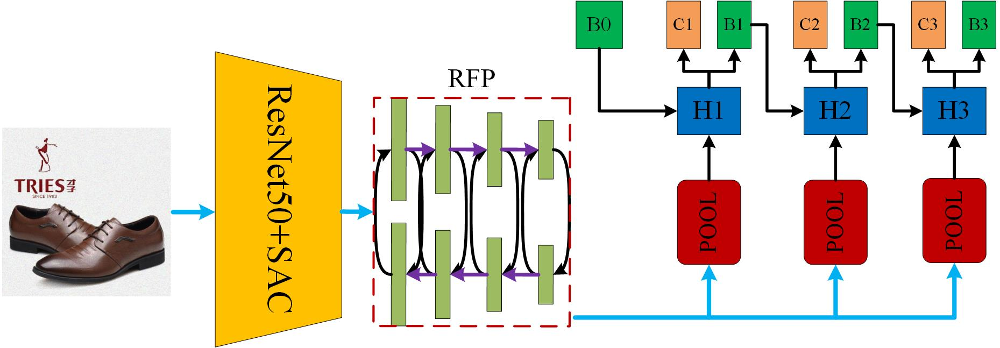
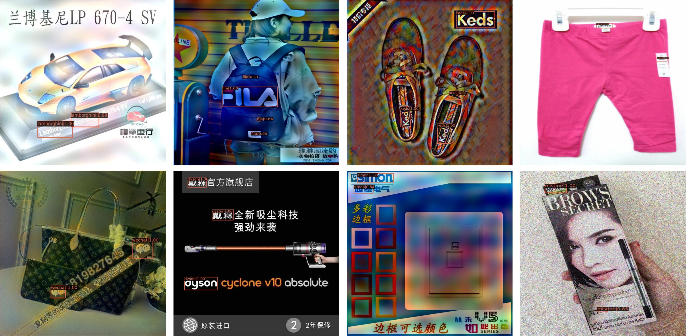

### 赛题背景

在商品知识产权领域，知识产权体现为在线商品的设计和品牌。不幸的是，在每一天，存在着非法商户通过一些对抗手段干扰商标识别来逃避侵权，这带来了很高的知识产权风险和财务损失。为了促进先进的多媒体人工智能技术的发展，以保护企业来之不易的创作和想法免受恶意使用和剽窃，因此提出了鲁棒性标识检测挑战赛 ([ACM MM2021 Robust Logo Detection](https://tianchi.aliyun.com/competition/entrance/531888/introduction))。挑战赛需要参赛者处理**小目标检测**、**长尾对象类别**、**对抗性干扰图像**。这一挑战集中于现实世界机器学习和多媒体系统中安全问题的最新研究和未来方向。

### 前言

- 本方案初赛排名 **TOP 6**，复赛排名 **TOP 2**，综合排名 **TOP 2**；
- 特别感谢阿里安全组织的这场比赛，一方面锻炼了我们的能力，一方面给了我们探索实际业务场景中各种困难的机会；

### 赛题攻关

##### 检测模型的选取：

我们选择了[**detectoRS**](https://arxiv.org/abs/2006.02334)作为我们的检测模型，该模型当前在目标检测coco排行榜排名第七，我们选择了其级联的框架。**Cascade_detectoRS**网络结构如下：



其中SAC (Switchable Atrous Convolution) 表示可切换的空洞卷积，它可以自适应选择感受野 ，其中 RFP (Recursive Feature Pyramid)采用循环结构来反复利用和精炼提取的特征，“H”表示检测头，我们使用了广泛使用的三级级联结构，“B”表示回归框，“C”表示类别预测结果，“B0”表示RPN网络的输出结果。除此之外，整个网络模型还使用了基于注意力的特征融合机制和类似SENet的全局上下文模块来增强网络的表征能力。显而易见，该网络结构基本**集合了常见的检测涨点的tricks**。对于backbone的选取，一般而言，越大越复杂的特征提取网络，往往具有较好的性能表现，通过对网络复杂程度与训练耗时tradeoff的多次实验和思考，我们最终选择了ResNet50作为基本的网络，并将网络中标准的3*3卷积换成SAC卷积模块。

##### 小目标处理策略：

对于小目标问题，我们并没有单独地去设计网络模块或者对数据进行小目标增广处理。由于网络模型的backbone是基于ResNet50的，所以我们可以使用较大尺度的输入，比如800，900，1000等。在兼顾小目标检测问题的同时，如何提升检测性能也是很重要的，在实验中我们采用了**多尺度训练**的机制，训练尺度最大边长为1333，短边尺度范围为800~1100。

##### 长尾分布处理：

对于长尾数据的处理，容易想到的处理方案有重采样和均衡损失这两种。正如前面所介绍的那样，重采样会增加训练的时间，而且采样率也不容易设置，对于大数据集很不友好。均衡损失，往往是通过对类别项概率进行权重矫正实现的。这种方案的缺陷在于忽略了背景候选区域的影响。此外，固定的权重值不一定适合不同训练阶段网络的学习。因此，我们使用了[EQ-Loss V2](https://arxiv.org/abs/2012.08548v1)作为检测模型中的分类损失函数，RPN处的分类损失，我们依然使用交叉熵损失函数。EQL_V2 loss的特点是基于梯度引导的，它根据正梯度与负梯度的累积比，分别对正负梯度进行加权矫正。

##### 对抗干扰的处理：

从初赛到复赛，我们都使用了**multi-scale testing**。尺度范围在训练尺度范围的基础我增加了（1333，1200），这种较大尺度的使用主要作用在于提升小目标检测的recall值以及提升模型鲁棒性。当然我们也尝试了一系列图像数字领域防御的方法，例如 JPEG compression，quantization，denoise 等经典的手段，这些方法都会造成检测性能的下降，其主要的原因在于测试数据集中包含图像数字攻击的对抗样本很少，绝大多数的对抗样本基本都是无限制攻击下产生的扰动，这些扰动的生成和常见的防御机理存在很大程度的不一致性，因此这些方法基本没有任何防御效果。甚至由于防御造成的信息损失，导致最终正常图片性能的下降。 因此，对于对抗干扰的可能有效的处理方法，是模拟当前噪声的生成，通过增广数据来提升模型的鲁棒性，我们尝试加Gaussian噪声、加雨、加雾、图像模糊化等方法，有一定程度的性能提升效果。

##### 检测效果图：



### 一些思考：

**通过此次比赛，我们发现其实每个检测模型都可以很鲁棒，这种鲁棒性并不需要特定的网络结构，模型鲁棒性很大程度取决于训练后网络收敛的位置点，不同的收敛点往往具有较大的鲁棒性差别。如何研究出有效的网络训练策略或许会是网络鲁棒性的基本保证!**:boom:

**Paper Link：** 
https://arxiv.org/abs/2108.00422

**checkpoint：**
Link：https://pan.baidu.com/s/1u12MAVgoIke6HobJLfbebg 

Password：6j2o

**Please cite：**

```
@article{jia2021effective,
  title={An Effective and Robust Detector for Logo Detection},
  author={Jia, Xiaojun and Yan, Huanqian and Wu, Yonglin and Wei, Xingxing and Cao, Xiaochun and Zhang, Yong},
  journal={arXiv preprint arXiv:2108.00422},
  year={2021}
}
```
